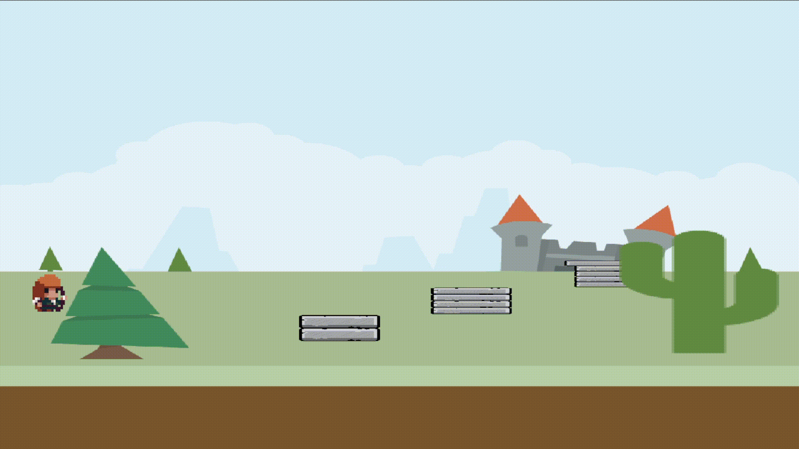

# Desafio M5 - Jogo de Plataforma 2D

## Resumo da Atividade

O objetivo desta atividade é **criar uma cena de um jogo 2D contendo pelo menos 3 camadas e objetos animados que interajam com o cenário**. A solução implementa um jogo de plataforma onde:

1. **3 Camadas de Profundidade:** 
   - Fundo (castelo), camada intermediária (solo e plataformas), frente (árvores decorativas)
2. **Objeto Animado:** 
   - Personagem (arqueiro) com 3 estados de animação (IDLE, WALK, JUMP)
3. **Interação com o Cenário:** 
   - Colisão com plataformas e solo
   - Física realista com gravidade
   - Movimento e pulo controlados pelo usuário

## Como Executar

1. **Pré-requisitos:**
	- Ter GLFW, GLAD e GLM configurados no ambiente de desenvolvimento.
	- Compilar o projeto com CMake.

2. **Compilação e execução:**
   No terminal, dentro da pasta do projeto, execute:
   ```
   cd build
   cmake --build .
   ```
   Após a compilação, execute o programa com:
   ```
   ./M5.exe
   ```

## Controles

- **A:** mover personagem para a esquerda
- **D:** mover personagem para a direita
- **ESPAÇO:** pular
- **ESC:** fecha a aplicação

## Resultado Esperado

- A janela abre exibindo um cenário com plataformas e árvores decorativas.
- Console exibe instruções de controle ao iniciar.
- A cada movimento:
  - Personagem anima entre os estados IDLE, WALK e JUMP
  - Física aplica gravidade
  - Colisões funcionam com plataformas e o solo
  - Árvores renderizam visualmente atrás/na frente do personagem conforme profundidade


