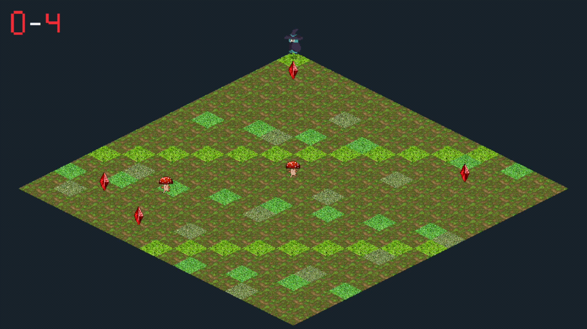

# Desafio M6 - Tilemap Isométrico 2D

## Resumo da Atividade

O objetivo desta atividade é desenvolver um jogo 2D com representação de cenário usando **tilemap** e **estratégia de indexação**. A solução implementa um jogo isométrico em formato de diamante, onde:

1. **Cenário em Tilemap:**
   - O mapa possui dimensão 16x16
   - Cada posição da matriz armazena um índice de tile
   - Os índices selecionam regiões específicas do tileset `Floor_Grass_01-128x64.png`

2. **Estratégia de Visualização:**
   - A classe `TileMap` armazena os índices do cenário
   - A interface `TilemapView` define a conversão entre coordenadas do mapa e coordenadas da tela
   - A classe `DiamondView` implementa a projeção isométrica em formato de diamante

3. **Personagem Animado:**
   - A personagem principal é a Blue Witch
   - A bruxa possui animação de movimento e animação de morte
   - O jogador controla a bruxa pelas setas do teclado

4. **Obstáculos Móveis:**
   - Dois Mushrooms atravessam o mapa em diagonais opostas, formando um "X"
   - Os Mushrooms usam sprites animados e invertem a direção visual conforme o movimento
   - Se a bruxa encostar em um Mushroom, ocorre derrota

5. **Objetivo do Jogo:**
   - Quatro cristais vermelhos aparecem em posições aleatórias no mapa
   - O jogador deve coletar todos os 4 cristais sem morrer
   - Ao coletar todos os cristais, a tela de vitória é exibida
   - Ao morrer, a tela de derrota é exibida

## Como Executar

1. **Pré-requisitos:**
	- Ter GLFW, GLAD e GLM configurados no ambiente de desenvolvimento
	- Compilar o projeto com CMake

2. **Compilação e execução:**
   No terminal, dentro da pasta do projeto, execute:
   ```
   cd build
   cmake --build .
   ```
   Após a compilação, execute o programa com:
   ```
   ./M6.exe
   ```

## Controles

- **Seta para cima:** move a bruxa uma célula para cima no mapa
- **Seta para baixo:** move a bruxa uma célula para baixo no mapa
- **Seta para esquerda:** move a bruxa uma célula para a esquerda no mapa
- **Seta para direita:** move a bruxa uma célula para a direita no mapa
- **R:** reinicia o jogo após vitória ou derrota
- **ESC:** fecha a aplicação

## Organização dos Arquivos

- `M6.cpp`: fluxo principal do jogo, atualização, colisão e renderização
- `Config.h`: constantes de janela, mapa, tiles e objetivo
- `TileMap.h`: matriz indexada do tilemap
- `TilemapView.h`: interface para estratégias de visualização do mapa
- `DiamondView.h`: projeção isométrica em diamante
- `GameTypes.h`: estruturas de sprites, atores, cristais, Mushrooms e estados do jogo
- `gl_utils.h/.cpp`: carregamento de texturas, spritesheets e shaders
- `_geral_vs.glsl`: vertex shader geral
- `_geral_fs.glsl`: fragment shader geral

## Resultado Esperado

- A janela abre exibindo um mapa isométrico em formato de diamante
- O cenário é renderizado a partir de uma matriz de índices de tiles
- A Blue Witch inicia na posição 0,0
- Os Mushrooms se movimentam em diagonais opostas pelo mapa
- Os cristais aparecem em posições aleatórias e desaparecem ao serem coletados
- O contador no canto superior esquerdo exibe a quantidade de cristais coletados
- Ao coletar os 4 cristais, a imagem de vitória aparece
- Ao colidir com um Mushroom, a animação de morte é executada e a imagem de derrota aparece
- Após vitória ou derrota, o jogador pode reiniciar com **R** ou sair com **ESC**


